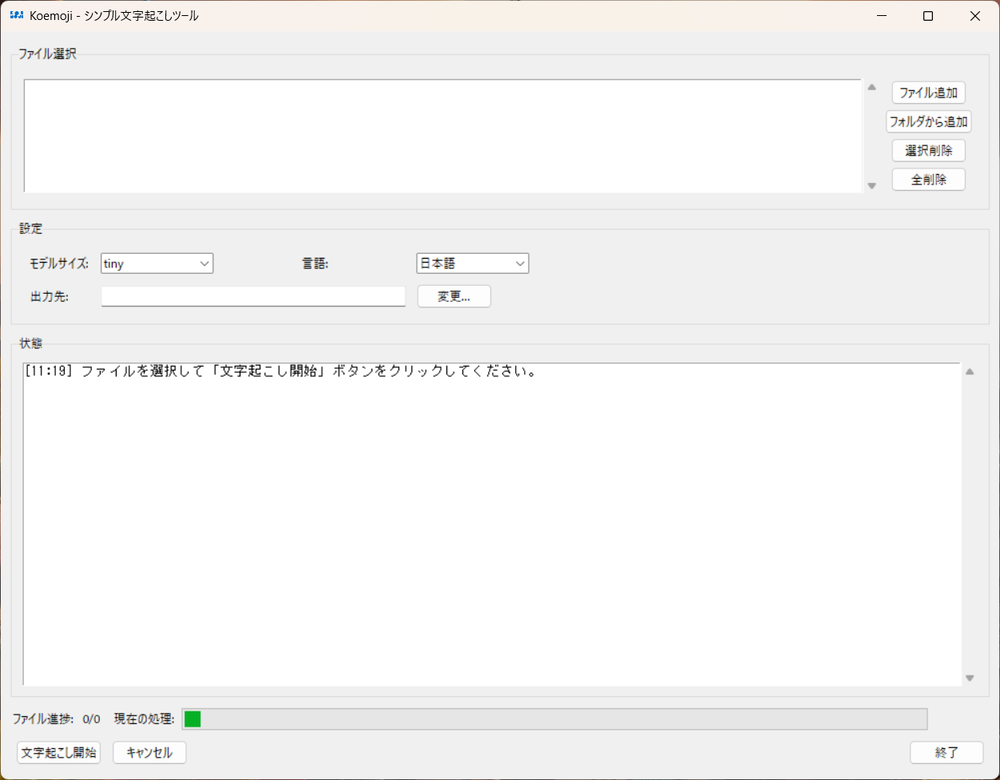

# Koemoji プロジェクト

シンプルな文字起こしツール「Koemoji」のプロジェクト概要です。

## プロジェクト概要

Koemoji（コエモジ）は、音声や動画ファイルから文字起こしを簡単に行うためのデスクトップアプリケーションです。OpenAI Whisperをベースに作られたFasterWhisperモデルを活用し、技術的な知識がなくても直感的に使用できるよう設計されています。

## スクリーンショット



Koemojiは直感的に操作できるシンプルなユーザーインターフェイスを備えています。ファイル選択、モデルサイズや言語の設定、文字起こし処理の進捗確認が一画面で完結します。

## ディレクトリ構造

```
koemoji/
│
├── main.py              # メインアプリケーション（すべての機能を含む）
├── config.json          # 設定ファイル（モデルサイズ、保存先など）
├── icon.ico             # アプリケーションアイコン
├── koemoji.bat          # 起動用バッチファイル（Windows）
├── koemoji.bat          # 起動用シェルスクリプト（Mac）
├── LICENSE              # MITライセンスファイル
└── README.md            # 説明ドキュメント
```

## 技術的決定事項

1. **シンプルな構造**: 単一のPythonファイル（`main.py`）にすべての機能を実装し、保守性と理解のしやすさを優先しています。

2. **外部依存関係**:
   - **FFmpeg**: システムにインストールされたFFmpegを使用します。これにより、アプリケーション自体の軽量化が図れます。
   - **FasterWhisper**: Pythonパッケージとしてインストールし、モデルファイルはデフォルトのキャッシュディレクトリ（`~/.cache/huggingface/hub`または`%USERPROFILE%\.cache\huggingface\hub`）に保存します。

3. **設定の永続化**: `config.json`ファイルを使用して、ユーザーの設定（選択したモデルサイズ、保存先など）を次回起動時に引き継ぎます。

4. **簡易起動**: `koemoji.bat`バッチファイルにより、ユーザーは簡単にアプリケーションを起動できます。

## 主要機能

- 直感的なGUIインターフェース
- 複数ファイルの一括処理対応
- Whisperモデルサイズの選択（tiny、base、small、medium、large）
- 言語選択（日本語、英語、自動検出）
- ローカルでの完全オフライン処理
- 処理進捗の表示
- 結果のテキストファイルへの保存
- 設定の保存と次回起動時の引き継ぎ

## 対象ユーザー

- 会議や講演の記録を文字に起こしたい一般ユーザー
- インタビューや音声メモを文字化したい研究者・学生
- 動画コンテンツに字幕を付けたいコンテンツ制作者
- 音声データから文字情報を抽出したいビジネスユーザー

## インストール方法

1. Pythonをインストール（Python 3.7以上を推奨）
2. 必要なパッケージをインストール:
   ```
   pip install huggingface_hub
   pip install faster-whisper
   ```
3. FFmpegをインストールしてPATHに追加
4. コンピュータを再起動（またはコマンドプロンプトを再起動）
5. アプリケーションを起動: `koemoji.bat`をダブルクリック

### インストール時の注意点

- huggingface_hubを先にインストールすることで、モデルのダウンロードに関する問題を防ぐことができます
- 初回起動時はモデルのダウンロードに時間がかかる場合があります（数分〜15分程度）
- 一度ダウンロードされたモデルは次回以降の起動では再ダウンロードされません

## セットアップ手順

### プロジェクトのセットアップ

1. プロジェクトフォルダを適切な場所に配置します（例：`C:\Program Files\Koemoji`または`C:\Users\ユーザー名\Documents\Koemoji`）

### ショートカットの作成（Windows）

1. `koemoji.bat`ファイルを右クリックし、「ショートカットの作成」を選択します
2. 作成されたショートカットをデスクトップなど任意の場所に移動させます
3. ショートカットのアイコンを設定するには:
   - ショートカットを右クリックして「プロパティ」を選択
   - 「ショートカット」タブの「アイコンの変更」ボタンをクリック
   - `アイコンファイルのパス\icon.ico`を参照して選択
   - 「OK」をクリックして設定を保存

これでデスクトップなどからワンクリックでKoemojiを起動できるようになります。

## 使用方法

1. 「ファイル追加」ボタンで処理したい音声/動画ファイルを選択
2. 「フォルダから追加」ボタンでフォルダ内のメディアファイルを一括追加
3. モデルサイズと言語を選択（デフォルトは「tiny」と「日本語」）
4. 「出力先」で文字起こし結果の保存先フォルダを指定
5. 「文字起こし開始」ボタンをクリックして処理開始
6. 処理状況はリアルタイムで表示されます
7. 処理完了後、結果を確認できます

## 注意事項

- CPUのみの環境では計算タイプは自動的に「int8」が使用されます
- 大きなファイルやlargeモデルの場合はロードや処理に時間がかかります
- 処理中は「キャンセル」ボタンで処理を中断可能です
- 初回実行時はモデルファイルがダウンロードされるため、インターネット接続が必要です
- 一度ダウンロードされたモデルは再利用されるため、2回目以降はオフラインでも使用可能です

## 謝辞

このプロジェクトは以下のオープンソースソフトウェアに支えられています：

- [Faster-Whisper](https://github.com/guillaumekln/faster-whisper) - OpenAI Whisperの高速な実装
- [OpenAI Whisper](https://github.com/openai/whisper) - 音声認識のための革新的なモデル
- [FFmpeg](https://ffmpeg.org/) - 動画・音声ファイル処理のためのツール
- [Python](https://www.python.org/) とその標準ライブラリ

これらのプロジェクトの開発者に感謝します。

## ライセンス

このプロジェクトはMITライセンスの下で提供されています。詳細は[LICENSE](LICENSE)ファイルを参照してください。
